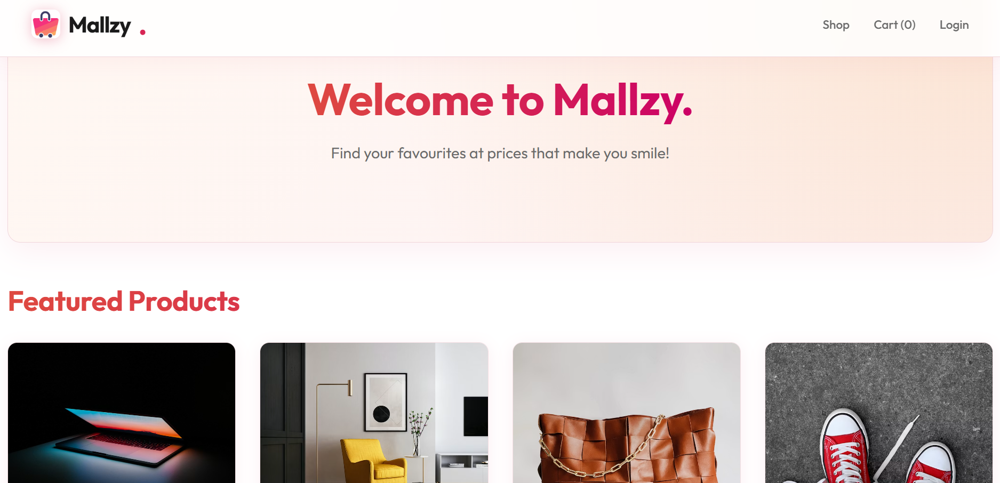

# Thistle AI 🌿

An AI-powered chatbot built with React and the Gemini API, featuring a conversational interface for real-time AI-generated responses.

## 🔗 Live Demo

[https://ai-chatbot-thistle.vercel.app/](https://ai-chatbot-thistle.vercel.app/)

## 🛠️ Tech Stack

- React
- Vite
- Node.js
- Gemini API
- CSS3

## ✨ Features

- Real time AI generated conversational responses
- Fast, hot-reloading development experience via Vite
- Component-based architecture for easy UI customization
- Centralized chat state management using React Context

## 📸 Screenshots



## 🚀 Running Locally

```bash
git clone https://github.com/soumyadeep-b/ai-chatbot-thistle.git
cd ai-chatbot-thistle
npm install
```

Create a `.env` file in the root and add your Gemini API key:

```
VITE_GEMINI_API_KEY=your_api_key_here
```

Then start the dev server:

```
npm run dev
```

## 👤 Author

Soumyadeep Biswas
[LinkedIn](https://linkedin.com/in/soumyadeep-biswas-264066418) • [GitHub](https://github.com/soumyadeep-b)
